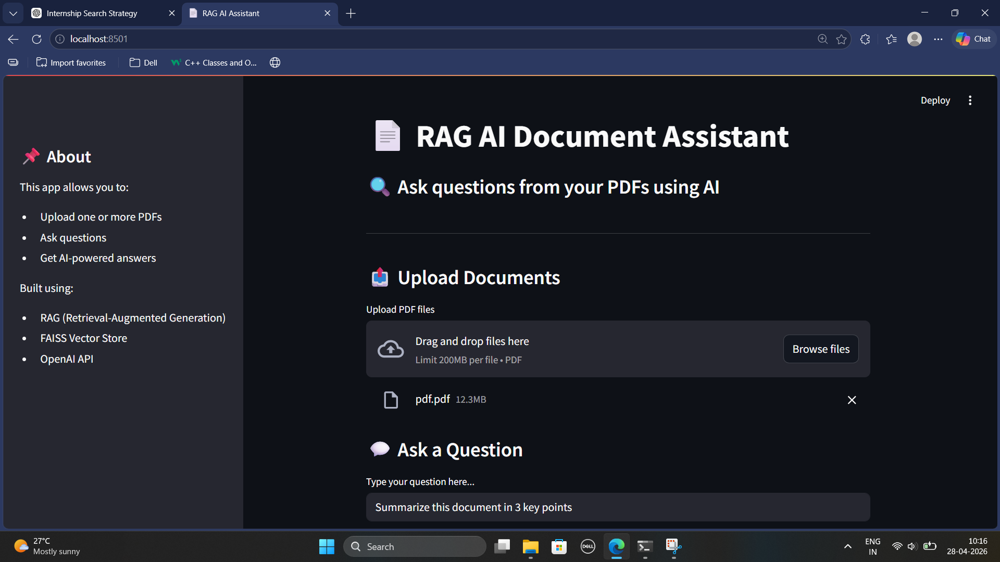
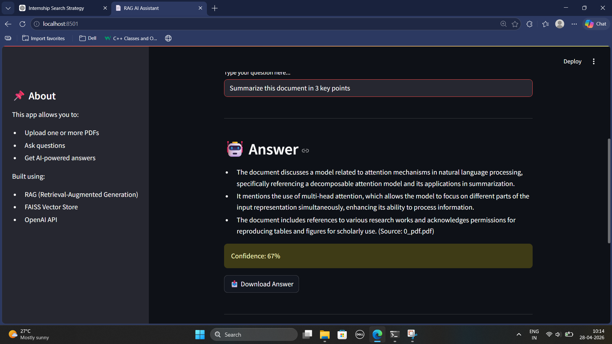

# 📄 RAG AI Document Assistant

An end-to-end **Retrieval-Augmented Generation (RAG)** system that allows users to upload PDF documents and ask questions using AI.

---

## 🚀 Features

- 📤 Upload multiple PDF documents
- 🔍 Ask questions in natural language
- 🤖 AI-generated answers using LLM
- 📚 Source context display (transparency)
- 🧠 Confidence score for answers
- 📥 Download generated answers
- ⚡ Fast retrieval using FAISS vector store
- 🧾 OCR support for scanned PDFs (Tesseract fallback)

---

## 🧠 How It Works

This project implements a complete **RAG pipeline**:

1. **Document Loading**
   - Extracts text using PyMuPDF
   - Uses OCR for scanned PDFs

2. **Text Cleaning**
   - Removes noise and normalizes content

3. **Chunking**
   - Splits documents into smaller chunks

4. **Embedding**
   - Converts text into vector embeddings

5. **Vector Store (FAISS)**
   - Stores embeddings for fast similarity search

6. **Retrieval**
   - Fetches relevant chunks based on query

7. **Generation**
   - LLM generates answer using retrieved context

---

## 🛠️ Tech Stack

- **Frontend:** Streamlit  
- **LLM:** OpenAI (`gpt-4o-mini`)  
- **Vector DB:** FAISS  
- **Embeddings:** HuggingFace (MiniLM)  
- **PDF Processing:** PyMuPDF + Tesseract OCR  
- **Framework:** LangChain  

---

## 📸 Screenshots

### 🔹 User Interface


### 🔹 AI Answer Output


### 🔹 Source Context


---

## 📂 Project Structure

```
rag-document-assistant/
│
├── app.py
├── requirements.txt
├── .gitignore
│
├── src/
│   ├── loader.py
│   ├── splitter.py
│   ├── embeddings.py
│   ├── retriever.py
│   ├── generator.py
│   └── pipeline.py
│
├── screenshots/
│   ├── ui.png
│   ├── answer.png
│   └── source.png
│
├── notebooks/
│   └── rag_experiments.ipynb
```

---

## ⚙️ Setup Instructions

### 1. Clone the repository
```bash
git clone https://github.com/subesh-cse/rag-document-assistant.git
cd rag-document-assistant
```

### 2. Create environment
```bash
conda create -n rag python=3.10
conda activate rag
```

### 3. Install dependencies
```bash
pip install -r requirements.txt
```

### 4. Set API Key
```bash
setx OPENAI_API_KEY "your_api_key_here"
```

### 5. Run the app
```bash
streamlit run app.py
```

---

## 🎯 Key Highlights

- ✅ Handles real-world noisy PDFs
- ✅ Supports scanned documents via OCR
- ✅ Implements complete RAG pipeline from scratch
- ✅ Clean and interactive Streamlit UI
- ✅ Transparent answers with source context
- ✅ Optimized retrieval using FAISS

---

## 📌 Future Improvements

- 💬 Chat history support
- 🔁 Reranking models for better retrieval
- 🌐 Deployment (Streamlit Cloud / AWS)
- 📄 Support for DOCX / TXT files
- ⚡ Faster indexing & caching

---

## 👨‍💻 Author

**Subesh** | B.Tech CSE | Machine Learning Enthusiast
